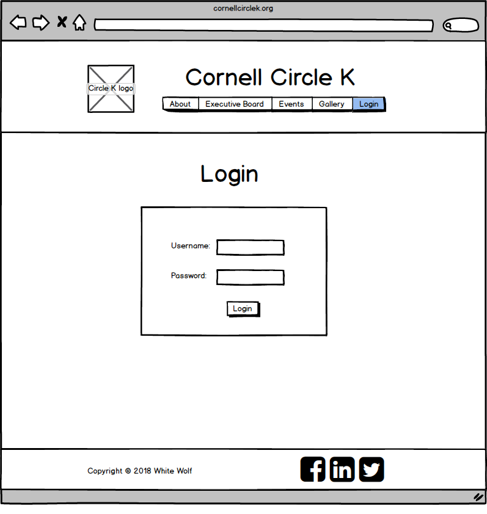

# Project 4 - Design & Plan

Your Team Name: White Wolf

## Milestone 1, Part II: Client Selection

### Client Description

[Tell us about your client. Who is your client? What kind of website do they want? What are their key goals?]

Our client is Circle K International, a community service club on Cornell's campus. They host multiple fundraisers and local charity events throughout the year. They want a website that students can use to find information about the club, upcoming events, current e-board, and pictures from previous events. Their key goals are to make sure that their members and the general student body have digital access to up-to-date information so that they can maximize volunteer participation and club awareness.

[NOTE: If you are redesigning an existing website, give us the current URL and some screenshots of the current site. Tell us how you plan to update the site in a significant way that meets the final project requirements.]


## Milestone 1, Part III: Client Requirements

### Target Audience(s)

[Tell us about the potential audience for this website. How, when, and where would they interact with the website? Get as much detail as possible from the client to help you find representative users.]

The target audience is undergraduate Cornell students, most likely freshmen and sophomores, who are looking for information on community service opportunities. They would interact with the website on their computers during the school week, after club fest, or on the weekends before service events.

### Purpose & Content

[Tell us the purpose of the website and what it is all about.]
The purpose of the website is to inform potential new members and current members about the mission of the club, their involvement with the Ithaca community and global charities, their current executive board members, and schedule of events and meetings. We will have five pages: an About page, E-board page, Gallery page, Log-In, and Upcoming Events page.

### Needs and Wants

[Collect your client's and target audience's needs and wants for the website. Come up with several appropriate design ideas on how those needs may be met. In the **Memo** field, justify your ideas and add any additional comments you have. There is no specific number of needs required for this, but you need enough to do the job.]

* Needs/Wants #1
  * **Needs and Wants** (What does your client and audience need and want?)
    * Client wants current members to be able to log in and update event schedule as well as add/delete images to the gallery.
  * **Design Ideas and Choices** (How will you meet those needs and wants?)
    * Use session ID and methods learned in class/lab to log in current members to show pages that are accessible to current members only. Clear log-in and log-out messages to let users know about their log-in status.
    * API that syncs Facebook updates to the website
  * **Memo** (Justify your decisions; additional notes.)
    * Log-in and session functionality can be done through modeling the techniques learned in class.
    * API would involve a steep learning curve and would be less feasible given our current knowledge.

    * Needs/Wants #2
      * **Needs and Wants** (What does your client and audience need and want?)
        * Client wants website to be eye-catching but not too colorful. They want the site to reflect the personality of the philanthropic personality of their club.
      * **Design Ideas and Choices** (How will you meet those needs and wants?)
        * Incorporate their logo and a color scheme consistent with their club's colors
        * A modern and intuitive yet professional styling on fonts, font sizes, headers, footers, and organization of body information.
      * **Memo** (Justify your decisions; additional notes.)
        * Logo and colors can be modified through diligent CSS styling
        * Styling on fonts and information can be optimized through visual design techniques learned in lecture.

### Hosting Plan

[What is your plan for hosting your client's website?]
We will inform the client about multiple paid and free options for hosting, such as Heroku. They will decide which platform is most suitable to their budget and usability.

### Client's Edits

[Does the client need the ability to edit the site after the end of the semester? If **Yes**, tell us how you site fit your client's need. If **No**, write down N/A.]
Yes, we want logged-in users to be able to continue to edit events, pictures, and e-board. General users will remain unable to edit the site in any manner.

### Information Architecture, Content, and Navigation

[Lay out the plan for how you'll organize the site and which content will go where. Note any content (e.g., text, image) that you need to make/get from the client.]

[Note: As with the Needs and Wants table, there is no specific amount to write here. You simply need enough content to do the job.]

Example:
* Content #1
  * **Main Navigation** (List your site's navigation here.)
    * About Us, Upcoming Events, Gallery, E-board, Log-In
  * **Sub-Categories** (List any sub-categories of under the main navigation.)
    * N/A
  * **Content** (List all the content corresponding to main navigation and sub-categories.)
    * *Main Navigation* : Horizontal navigation bar that highlights tabs when hovered over
    * *About Us*: list the mission statement, history, philanthropy initiatives, tenets, and awards/achievements.
    * *Upcoming Events*: list all dates and times for upcoming events for the current semester, including district and national events. Log-in members should be able to edit events on this page.
    * *Gallery*: display a slideshow of photos showcasing volunteers at a wide range of events
    * *E-board*: photos and short biographies of current e-board members in the club so that users can put a face to the leaders of the club
    * *Log-in*: A page with a log-in and password box for members to log-in to make changes to gallery and event schedule
    * *Contact*: Contact information will be in footer of page


### Interactivity

[What interactive features will your site have? What PHP elements will you include?]

[Much of this is up to you, however, implementing a login system is **required**. Logging in should not be required to view the site, however it must unlock extra functionality, e.g., admin functionality, comment posting, etc.]

* Log-in system that will unlock adding/deleting of events on the events page and adding/deleting images on the gallery page. General users will be able to view this information but not edit it.
* A slideshow for images to allow users to transition between image viewing smoothly
* Hover and highlight feature that lets users know which page they are on

[Also, describe how the interactivity connects with the needs of the clients/target audience.]
* Logging in allows the client's members to control the content of the website to keep it up-to-date with service events and images while also preventing non-members from making changes
* A slideshow will allow viewers to move seamlessly through the photo gallery and give users a better sense of what the club does/what they are like, thereby encouraging them to join.
* Hover and highlight features will allow users to keep track of their position through the website and make clear their actions in regards to navigation, which fulfills client's desires to have a modern and intuitive website design

### External Code

[What libraries (e.g. editor.js, jQuery Cookie, Image Sliders, jQuery) are you planning to use for the site? What do you have to do to incorporate those libraries? How much of your own code will satisfy the project requirements?]
* javascript for the slideshow
* 90% of our code will be our own, with the rest coming from references to class code and external code. We will have a javascript folder under our styles folder.

### Scale

[How large will the site be (approximate number of pages) and how many hours of work will be required to complete it?]
The site will be approximately 5 pages (perhaps an extra one or two pages that users will be redirected to for editing) and will require 120 hours of work, with approximately 30 hours of work a week (6 hours per team member per week).

## Milestone 1, Part IV: Work Distribution

[Describe how each of your responsibilities will be distributed among your group members.]

[Set internal deadlines. Determine your internal dependencies. Whose task needs to be completed first in order for another person's task to be relevant? Be specific in your task descriptions so that everyone knows what needs to be done and can track the progress effectively. Consider how much time will be needed to review and integrate each other's work. Most of all, make sure that tasks are balanced across the team.]

Everyone will be involved in the coding, with all the languages.
Jessica & Aileen: planning databases, testing
Shaina: information architecture and content
Kathy: sketches, wireframing
George: sketches, wireframing
Everyone will review everyone else's work and help out wherever possible.

Aim for milestones to be finished by Monday so that we have a buffer of time.
Wireframing and sketching done by Thursday (George, Kathy).
Back-end coding needs to be done first to set infrastructure for design and fine-tuning of interactivity (Jessica, Aileen).
Start coding and have a skeleton site ready by the end of Milestone 2. Full engagement in coding begins after Milestone 2 (Everyone).
Draft of site should be well-rounded by end of Milestone 3. Perfecting details and functionality throughout Milestone 4 to 5.

## Milestone 1, Part V: Additional Comments

[If you feel like you haven't fully explained your design choices, or if you want to explain some other functions in your site (such as special design decisions that might not meet the final project requirements), you can use this space to justify your design choices or ask other questions about the project and process.]


## Milestone 2, Part I: PHP Interactivity

[Describe here what you plan to do for your PHP Interactivity requirement.]
* Log-in system that will unlock adding/deleting of events on the events page, adding/deleting images on the gallery page, and editing the eboard information. General users will be able to view this information but not edit it. Use PHP to show the tables, and control whether or not a user can see the content.
* Hover and highlight feature that lets users know which page they are on. Use an array that contains all the tabs. Add an if statement in the header (if we are on a certain page, then highlight the text of the tab).

## Milestone 2, Part II: Sketches, Navigation & Wireframes

### Sketches

[Insert your sketches here.]


### Navigation

[What will be your top-level pages and your sub-pages for those top-level pages? What will your website's navigational structure?]

[Tip: If you use card sorting for your navigation, show us that work by including a picture!]

Example:
- Home
- About
- Executive Board
- Events
- Gallery
- Login
- Logout

### Wireframes

[Insert your wireframes here.]




## Milestone 2, Part III: Evaluate your Design

[Use the GenderMag method to evaluate your wireframes.]

[Pick a persona that you believe will help you address the gender bias within your design.]

We have selected **Abby** as our persona because she has a demonstrated interest and expertise in issues surrounding gender dynamics in the workplace, and thus is uniquely situated to address gender-inclusiveness bugs in our design. Her specific expertise in the area is an asset as we are actively designing to mitigate the potential for these bugs, so a persona who is sensitive to even minor bugs would be the most effective.


### Tasks

[You will need to evaluate at least 3 tasks (known as scenarios in the GenderMag literature). List your tasks here. These tasks are the same as the task you learned in INFO/CS 1300.]

[For each task, list the ideal set of actions that you would like your users to take when working towards the task.]

Task 1: Find the name and contact details for the VP of Finance.

  1. Move the mouse to the Eboard tab in the navigation.
  2. Click on the Eboard tab.
  3. Scroll through the page until they find the VP of Finance and their information.

Task 2: Login and update the Recruitment Chair's photo.

1. Move the mouse to the Login tab in the navigation.
2. Click on the Login tab.
3. Select the username field by clicking on it.
4. Enter the username (provided)
5. Select the password field by clicking on it.
6. Enter the password (provided)
7. Click on the Login button.
8. Move the mouse to the Eboard tab in the navigation.
9. Scroll through the page to find the Recruitment Chair.
10. Click the edit button near the Recruitment Chair's profile (it will redirect to eboard_edit.php, which allows a logged-in user to make edits via a form).
11. Click on 'upload image'.
12. Select image from the desktop (provided).
13. Click on submit button.

Task 3: Determine when and where the weekly meetings are held.

1. Move the mouse to the About tab in the navigation.
2. Click on the About tab.
3. Scroll through the page to find the section detailing the time and location of weekly meetings.

### Cognitive Walkthrough

[Perform a cognitive walkthrough using the GenderMag method for all of your Tasks. Use the GenderMag template in the <documents/gendermag-template.md> file.]

#### Task 1 - Cognitive Walkthrough

**Task name: Find the name and contact details for the VP of Finance**

**Subgoal #1 : Navigate to eBoard tab**

  - Will Abby have formed this sub-goal as a step to their overall goal?
    - Yes, maybe or no: Yes
    - Why? This should be intuitive for Abby as a nav bar is a familiar way to navigate a webpage, and the Eboard tab is clearly labeled and self-explanatory.

    **Action #1 : Move the mouse to the Eboard tab in the navigation**

      - Will Abby know what to do at this step?
        - Yes, maybe or no: Yes
        - Why? Given that Abby has low confidence about doing unfamiliar computing tasks, this should not be an issue. She is competent enough to work with spreadsheets, so moving a mouse and clicking on clearly labeled links is child's play for her.

      - If Abby does the right thing, will she know that she did the right thing, and is making progress towards her goal?
        - Yes, maybe or no: Yes
        - Why? We will code the CSS so that if you hover over a link in the nav bar, it will stand out in some way (e.g. highlight, change color etc). This is common practice across many webpages, and will likely be a familiar signifier to Abby that she is on the right track.

    **Action #2 : Click on the Eboard tab**

      - Will Abby know what to do at this step?
        - Yes, maybe or no: Yes
        - Why? As mentioned above, she is comfortable with simple computing tasks, so moving the mouse and selecting clearly navigable links are within the scope of her comfort zone.

      - If Abby does the right thing, will she know that she did the right thing, and is making progress towards her goal?
        - Yes, maybe or no: Yes
        - Why? She will see that the page she is looking for has loaded.

**Subgoal #2 : Scroll through the page until they find the VP of Finance and their information**

    - Will Abby have formed this sub-goal as a step to their overall goal?
      - Yes, maybe or no: Yes
      - Why? This should be intuitive for Abby as most users' first instinct will be to skim through the page for information. The members and their roles are clearly labeled so will be quickly visible to a viewer.

#### Task 2 - Cognitive Walkthrough

**Task name: Login and update the Recruitment Chair's photo.**

**Subgoal #1 : Login**

  - Will Abby have formed this sub-goal as a step to their overall goal?
    - Yes, maybe or no: Yes
    - Why? It is in the description of the goal, and she has been provided the username and password.

    **Action #1 : Move the mouse to the Login tab in the navigation**

      - Will Abby know what to do at this step?
        - Yes, maybe or no: Yes
        - Why? Given that Abby has low confidence about doing unfamiliar computing tasks, this should not be an issue. She is competent enough to work with spreadsheets, so moving a mouse and clicking on clearly labeled links is child's play for her.

      - If Abby does the right thing, will she know that she did the right thing, and is making progress towards her goal?
        - Yes, maybe or no: Yes
        - Why? We will code the CSS so that if you hover over a link in the nav bar, it will stand out in some way (e.g. highlight, change color etc). This is common practice across many webpages, and will likely be a familiar signifier to Abby that she is on the right track.

    **Action #2 : Click on the Login tab**

      - Will Abby know what to do at this step?
        - Yes, maybe or no: Yes
        - Why? As mentioned above, she is comfortable with simple computing tasks, so moving the mouse and selecting clearly navigable links are within the scope of her comfort zone.

      - If Abby does the right thing, will she know that she did the right thing, and is making progress towards her goal?
        - Yes, maybe or no: Yes
        - Why? She will see that the page she is looking for has loaded.

    **Action #3 : Move the mouse to the Login tab in the navigation**

      - Will Abby know what to do at this step?
        - Yes, maybe or no: Yes
        - Why? Given that Abby has low confidence about doing unfamiliar computing tasks, this should not be an issue. She is competent enough to work with spreadsheets, so moving a mouse and clicking on clearly labeled links is child's play for her.

      - If Abby does the right thing, will she know that she did the right thing, and is making progress towards her goal?
        - Yes, maybe or no: Yes
        - Why? We will code the CSS so that if you hover over a link in the nav bar, it will stand out in some way (e.g. highlight, change color etc). This is common practice across many webpages, and will likely be a familiar signifier to Abby that she is on the right track.

    **Action #4 : Click on the Eboard tab**

      - Will Abby know what to do at this step?
        - Yes, maybe or no: Yes
        - Why? As mentioned above, she is comfortable with simple computing tasks, so moving the mouse and selecting clearly navigable links are within the scope of her comfort zone.

      - If Abby does the right thing, will she know that she did the right thing, and is making progress towards her goal?
        - Yes, maybe or no: Yes
        - Why? She will see that the page she is looking for has loaded.

    **Action #5 : Select the username field by clicking on it**

      - Will Abby know what to do at this step?
        - Yes, maybe or no: Yes
        - Why? Abby writes and edits spreadsheet formulae for work, which means she knows that to input something into a cell, the cell must be clicked on.

      - If Abby does the right thing, will she know that she did the right thing, and is making progress towards her goal?
        - Yes, maybe or no: Yes
        - Why? Yes, there should be a blinking cursor in the input field, or the input area should be highlighted or boldened in some way to make it stand out.

    **Action #6 : Enter the username (provided)**

    - Will Abby know what to do at this step?
      - Yes, maybe or no: Yes
      - Why? Abby is comfortable with process-oriented learning. She writes and edits spreadsheet formulae for work, which suggests she would know how to log in to a portal (whether computer, email, or a website - the username/password process is similar across many platforms). Given the username, she would know to input it into the correctly labeled field.

    - If Abby does the right thing, will she know that she did the right thing, and is making progress towards her goal?
      - Yes, maybe or no: No
      - Why? Not yet, but she will know when she clicks on the login button. There, either the webpage will confirm she is logged in as the user provided, or will provide an error message stating that either the username or password is incorrect, in which case she can double check she inputted both correctly.

    **Action #7 : Select the password field by clicking on it**

    - Will Abby know what to do at this step?
      - Yes, maybe or no: Yes
      - Why? Abby writes and edits spreadsheet formulae for work, which means she knows that to input something into a cell, the cell must be clicked on.

    - If Abby does the right thing, will she know that she did the right thing, and is making progress towards her goal?
      - Yes, maybe or no: Yes
      - Why? Yes, there should be a blinking cursor in the input field, or the input area should be highlighted or boldened in some way to make it stand out.

    **Action #8 : Enter the password (provided)**

    - Will Abby know what to do at this step?
      - Yes, maybe or no: Yes
      - Why? Abby is comfortable with process-oriented learning. She writes and edits spreadsheet formulae for work, which suggests she would know how to log in to a portal (whether computer, email, or a website - the username/password process is similar across many platforms). Given the password, she would know to input it into the correctly labeled field.

    - If Abby does the right thing, will she know that she did the right thing, and is making progress towards her goal?
      - Yes, maybe or no: No
      - Why? Not yet, but she will know when she clicks on the login button. There, either the webpage will confirm she is logged in as the user provided, or will provide an error message stating that either the username or password is incorrect, in which case she can double check she inputted both correctly.

    **Action #9 : Click on the Login button**

    - Will Abby know what to do at this step?
      - Yes, maybe or no: Yes
      - Why? As mentioned above, she is used to process-oriented learning and so is used to the similar login methods across platforms. The logical step after inputting the username and password provided her is to press the login button.

    - If Abby does the right thing, will she know that she did the right thing, and is making progress towards her goal?
      - Yes, maybe or no: Yes
      - Why? Either the webpage will confirm she is logged in as the user provided, or will provide an error message stating that either the username or password is incorrect, in which case she can double check she inputted both correctly.

**Subgoal #2 : Change the Recruitment Chair's photo**

    - Will Abby have formed this sub-goal as a step to their overall goal?
      - Yes, maybe or no: Yes
      - Why? This is the main thing that is required of her in the task.

    **Action #1 : Move the mouse to the Eboard tab in the navigation**

        - Will Abby know what to do at this step?
          - Yes, maybe or no: Yes
          - Why? Given that Abby has low confidence about doing unfamiliar computing tasks, this should not be an issue. She is competent enough to work with spreadsheets, so moving a mouse and clicking on clearly labeled links is child's play for her.

        - If Abby does the right thing, will she know that she did the right thing, and is making progress towards her goal?
          - Yes, maybe or no: Yes
          - Why? We will code the CSS so that if you hover over a link in the nav bar, it will stand out in some way (e.g. highlight, change color etc). This is common practice across many webpages, and will likely be a familiar signifier to Abby that she is on the right track.

    **Action #2 : Click on the Eboard tab**

        - Will Abby know what to do at this step?
          - Yes, maybe or no: Yes
          - Why? As mentioned above, she is comfortable with simple computing tasks, so moving the mouse and selecting clearly navigable links are within the scope of her comfort zone.

        - If Abby does the right thing, will she know that she did the right thing, and is making progress towards her goal?
          - Yes, maybe or no: Yes
          - Why? She will see that the page she is looking for has loaded.

  **Action #3 : Scroll through the page until they find the Recruitment Chair**

        - Will Abby know what to do at this step?
          - Yes, maybe or no: Yes
          - Why? his should be intuitive for Abby as most users' first instinct will be to skim through the page for the specific information they need.

        - If Abby does the right thing, will she know that she did the right thing, and is making progress towards her goal?
          - Yes, maybe or no: Yes
          - Why? The members and their roles are clearly labeled so will be quickly visible to a viewer, and she should easily be able to identify the profile of the Recruitment Chair.

  **Action #4 : Click the edit button near the Recruitment Chair's profile**

        - Will Abby know what to do at this step?
          - Yes, maybe or no: Yes
          - Why? It will be clearly visible and labeled, and it is intuitive to click on 'edit' in order to change or update something. Abby is experienced in Excel, which uses the same terminology (e.g. 'edit cell' shows up when you hover over a cell)

        - If Abby does the right thing, will she know that she did the right thing, and is making progress towards her goal?
          - Yes, maybe or no: Yes
          - Why? The page will redirect to eboard_edit.php, which allows a logged-in user to make edits via a form. It will be clear to her how to change the information in the Recruitment Chair's profile, in this case their photo.

  **Action #5 : Click on 'upload image'**

        - Will Abby know what to do at this step?
          - Yes, maybe or no: Yes
          - Why? Abby is used to process-oriented learning and so is used to the similar upload methods and mechanisms across platforms. The word 'image' is also a useful sign, as the other input fields will all be text-based.

        - If Abby does the right thing, will she know that she did the right thing, and is making progress towards her goal?
          - Yes, maybe or no: Yes
          - Why? A box will pop up that allows her to choose an image - this is a clear indicator she is on the right track.

  **Action #6 : Select image from the desktop (provided)**

        - Will Abby know what to do at this step?
          - Yes, maybe or no: Yes
          - Why? The box that pops up in the previous step will clearly indicate the locations she may choose in image from. She will have been provided the image by us and so will have the file directory.

        - If Abby does the right thing, will she know that she did the right thing, and is making progress towards her goal?
          - Yes, maybe or no: Yes
          - Why? She will see that the image has been selected once she clicks on it as it will change color in the box (surrounded by blue) and the file path will have the name of the image.

  **Action #7 : Click on the Submit button**

        - Will Abby know what to do at this step?
          - Yes, maybe or no: Yes
          - Why? As mentioned above, she is used to process-oriented learning and so is used to the similar submission methods across platforms. The logical step after making the change she needed to (i.e. uploading the new image) is to press the submit button.

        - If Abby does the right thing, will she know that she did the right thing, and is making progress towards her goal?
          - Yes, maybe or no: Yes
          - Why? Either the form will return a 'Form Successfully Submitted' response, or will provide an error message stating that the file could not be uploaded - ideally with a reason e.g. file size issue - in which case she can try again after correcting the issue.

#### Task 3 - Cognitive Walkthrough

**Task name: Determine when and where the weekly meetings are held**

**Subgoal #1 : Navigate to About tab**

  - Will Abby have formed this sub-goal as a step to their overall goal?
    - Yes, maybe or no: Maybe
    - Why? Locating and selecting a tab should be intuitive for Abby as a nav bar is a familiar way to navigate a webpage, but she may be confused between the About and the Events tabs. Testing various users will allow us to determine which tab is more intuitive to the average viewer of the website in that they would expect it to hold information about the organization's weekly meetings.

    **Action #1 : Move the mouse to the About tab in the navigation**

      - Will Abby know what to do at this step?
        - Yes, maybe or no: Yes
        - Why? Given that Abby has low confidence about doing unfamiliar computing tasks, this should not be an issue. She is competent enough to work with spreadsheets, so moving a mouse and clicking on clearly labeled links is child's play for her.

      - If Abby does the right thing, will she know that she did the right thing, and is making progress towards her goal?
        - Yes, maybe or no: Yes
        - Why? We will code the CSS so that if you hover over a link in the nav bar, it will stand out in some way (e.g. highlight, change color etc). This is common practice across many webpages, and will likely be a familiar signifier to Abby that she is on the right track.

    **Action #2 : Click on the About tab**

      - Will Abby know what to do at this step?
        - Yes, maybe or no: Yes
        - Why? As mentioned above, she is comfortable with simple computing tasks, so moving the mouse and selecting clearly navigable links are within the scope of her comfort zone.

      - If Abby does the right thing, will she know that she did the right thing, and is making progress towards her goal?
        - Yes, maybe or no: Yes
        - Why? She will see that the page she is looking for has loaded.

**Subgoal #2 : Scroll through the page to find the section detailing the time and location of weekly meetings**

    - Will Abby have formed this sub-goal as a step to their overall goal?
      - Yes, maybe or no: Yes
      - Why? This should be intuitive for Abby as most users' first instinct will be to skim through the page for information. The weekly meetings' time and location will be clearly delineated in a differently formatted section under the main About paragraph.

### Cognitive Walk-though Results

We realized that the wording for the Eboard page - and all the pages - must be gender-inclusive. Members are diverse and can be anywhere on the fluid gender spectrum, and the website should reflect and project the welcoming and inclusive nature of the organization both to uphold its values and to put potential new members at ease. We will work on the labels and wording for the form and for the content to ensure that the whole website is gender-inclusive - however, currently we have a skeleton website this so this is not visible. We also noticed that deciding on a location for the weekly meetings could be difficult - it is not entirely intuitive which tab it should be placed under. Further user testing will be required to determine which tab is the most suitable (currently, it seems to be between About and Events - user testing in future rounds will clarify which is the most sensible option)

[Did you discover any issues with your design? What were they? How did you change your design to address the gender-inclusiveness bugs you discovered?]

[Your responses here should be very thorough and thoughtful.]

## Milestone 2, Part IV: Database Plan

### Database Schema

[Describe the structure of your database. You may use words or a picture. A bulleted list is probably the simplest way to do this.]

Our website will consist of four tables in our database. Table1 will contain user accounts for current members, Table2 will store photos for our gallery, Table3 will have current members and the fourth table will contain information about upcoming events. The table will also be updated as the members add events.

Table: accounts
* field 1: id INTEGER {PRIMARY KEY, NOT NULL, AUTO INCREMENT,UNIQUE}
* field 2: username {TEXT NOT NULL UNIQUE}
* field 3: password {TEXT NOT NULL UNIQUE}
* field 4: session {TEXT UNIQUE}

Table: gallery
* field 1: id INTEGER {PRIMARY KEY, NOT NULL, AUTO INCREMENT,UNIQUE}
* field 2: g_image {TEXT NOT NULL}
* field 3: g_image_name {TEXT NOT NULL}

Table: eboard
* field 1: id INTEGER {PRIMARY KEY, NOT NULL, AUTO INCREMENT,UNIQUE}
* field 2: eboard_image {TEXT NOT NULL}
* field 3: eboard_name {TEXT NOT NULL}

Table: events
* field 1: id INTEGER {PRIMARY KEY, NOT NULL, AUTO INCREMENT,UNIQUE}
* field 2: event_name {TEXT NOT NULL}
* field 3: date {TEXT NOT NULL UNIQUE}
* field 4: time {TEXT NOT NULL}
* field 5: location {TEXT NOT NULL}
* field 6: description {TEXT NOT NULL}

### Database Queries

[Plan your database queries. You may use natural language, pseudocode, or SQL.]
* Inserting Query for events table (adding information)

"INSERT INTO events(event_name, date, time, location, description) VALUES (:event_name, :date, :time, :location, :description)";

* Deleting Query for events and images
Note: delete button will be placed underneath photo. Once user clicks on delete
button, run the query to delete the image by its id.

"DELETE FROM events WHERE id = $record[id]";

"DELETE FROM gallery WHERE id = $record[id]";

* Selecting Query for edits
SELECT g_image FROM gallery WHERE g_image = $record[id]"

SELECT eboard_image FROM eboard WHERE eboard_image = $record[id]"

## Milestone 2, Part V: Structure and Pseudocode

### Structure

[List the PHP files you will have. You will probably want to do this with a bulleted list.]

* index.php - main page.
* includes/init.php - stuff that useful for every web page.
* header.php
* footer.php
* gallery.php
* login.php
* logout.php
* events.php
* eboard.php
* eboard_edit.php

### Pseudocode

[For each PHP file, plan out your pseudocode. You probably want a subheading for each file.]

We will have five pages: an About page, E-board page, Gallery page, Log-In, and Upcoming Events page.

#### header.php

```
title of website

for loop iterating through navigation links of pages that will be available for user. Pages that show will depend on:
- whether admin is logged in or logged out
- styled depending on which page user is currently on

show message whether a user is currently logged in or not.
```

#### footer.php

```
credits to us (names and net ids)

```
#### index.php

```
includes header and footer at top and bottom of page

text with formatting for:
- mission statement
- history
- philanthropy initiatives
- awards/recognition

```
#### includes/init.php

```
array of all pages used in header

messages = array to store messages for user

// DB helper functions

db = connect to db

login and logout functions

checking if user is logged in

```
#### eboard.php

```
includes header and footer at top and bottom of page

show profiles of e-board members (formatted text and images)
- name
- major
- title
- info
- profile photo

include delete button near every eboard member, include add button, include edit button near every eboard member

```

#### edit_eboard.php

```
form that allows you to edit information on specific eboard member

```

#### gallery.php

```
includes header and footer at top and bottom of page

slideshow of photos with captions
 - formatted using Javascript
 - making sql query
 - executing sql query
 - iterating through records of photos and displaying them in slideshow

if statement giving a link to edit photos if admin is logged in

```
#### events.php

```
includes header and footer at top and bottom of page

formatted table with upcoming events with fields containing date, info, etc. from our database
- making sql query
- executing sql query
- iterating through event and event details to show in table

```

#### login.php

```
includes header and footer at top and bottom of page

only shows in header if user is not logged in

will have a form that allows users to put in usernames and passwords and a submit button

will filter input and escape output

```
#### logout.php

```
includes header and footer at top and bottom of page

only shows in header once user is logged in

clear session and display message to user whether or not log out was successful

```

## Milestone 2, Part VI: Additional Comments

[Add any additional comments you have here.]


## Milestone 3: Updates

[If you make any changes to your plan or design, make a list of the changes here.]


## Milestone 4: Updates

[If you make any changes to your plan or design based on your peers' feedback, make a list of the changes here.]


## Milestone 5: Cognitive Walkthrough

[Copy your tasks here from Milestone 2. Update them if you need to and then conduct another cognitive walkthrough.]

### Cognitive Walk-though Results

[Did you discover any issues with your design? What were they? How did you change your design to address the gender-inclusiveness bugs you discovered?]

[Your responses here should be very thorough and thoughtful.]

## Milestone 5: Final Notes to the Clients

[Describe in some detail what the client will do (or would have to do) in order to make this website go live. What is the deployment plan?]

[Include any other information that your client needs to know about your final website design. For example, what client wants or needs were unable to be realized in your final product? Why were you unable to meet those wants/needs?]

## Milestone 5: Final Notes to the Graders

[1. Give us three specific strengths of your site that sets it apart from the previous website of the client (if applicable) and/or from other websites. Think of this as your chance to argue for the things you did really well.]

[2. Tell us about things that don't work, what you wanted to implement, or what you would do if you keep working with the client in the future. Give justifications.]

[3. Tell us anything else you need us to know for when we're looking at the project.]
